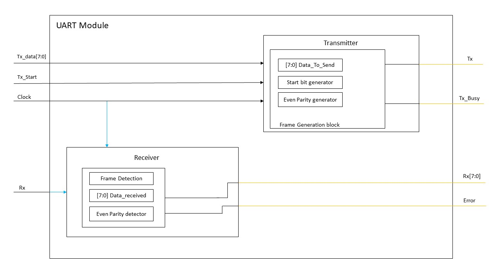

# Universal Asynchrounous Receiver Transmitter (UART) Module
#### Implementing a simple UART module using Verilog HDL. The project contains 2 small modules (transmitter and receiver) and the top module that contains both of them. Every module has a separate testbench to make sure that it works correctly.

# Design

# Notes: 
#### • This repo can be opened and synthesised using Xilinx ISE Design Suite.
#### • The module is working on 50MHz clock and baudrate of 115200 bps.
